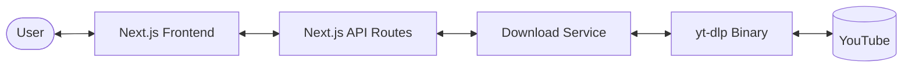
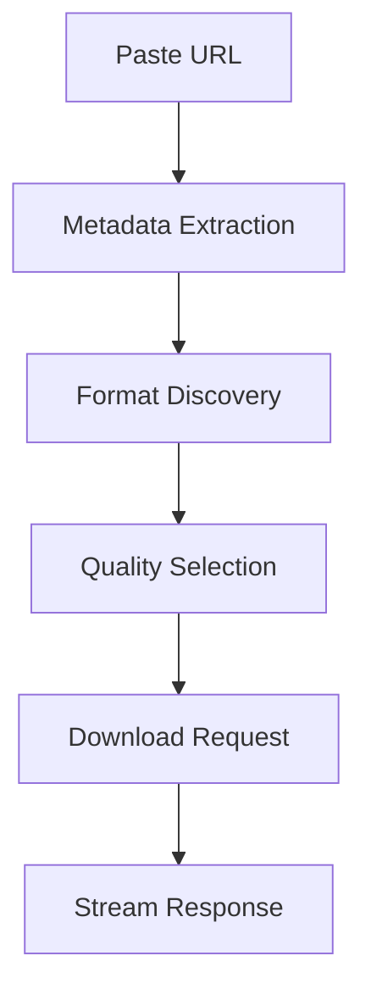
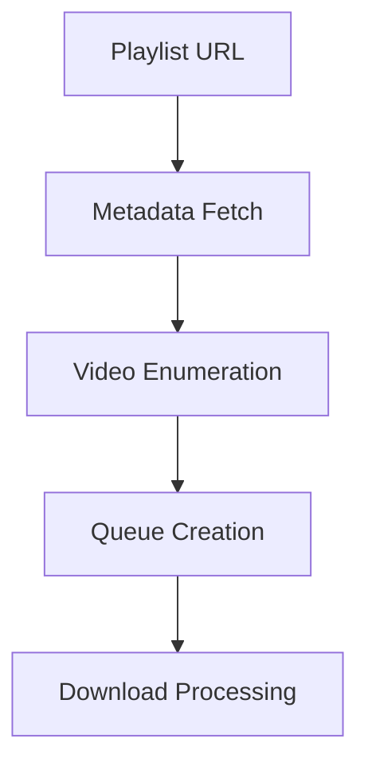
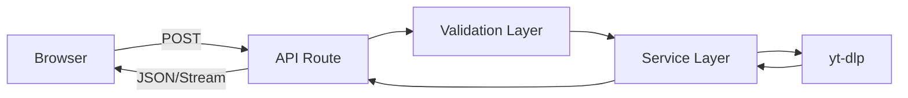
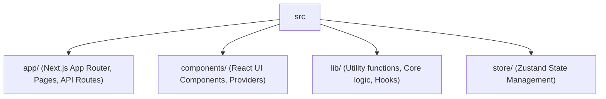
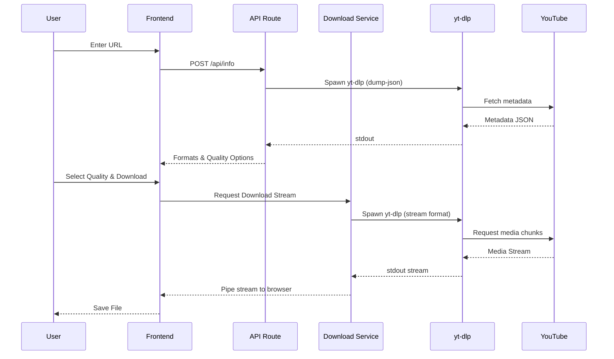
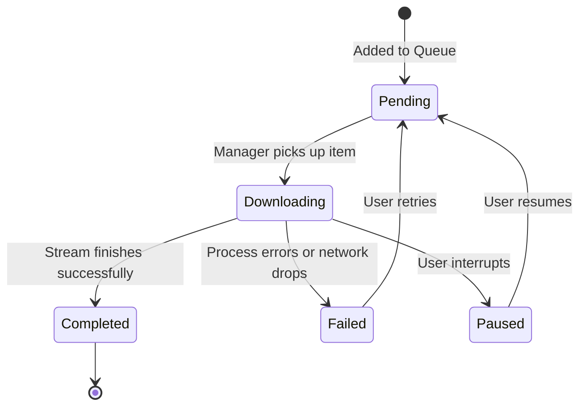

# YouTube Video Downloader

An open-source interface and queue manager for `yt-dlp` built with Next.js.

## Why this exists

Most online downloaders are cluttered with ads, redirects, misleading buttons, and poor user experiences. This project provides a transparent, local-first workflow by wrapping the `yt-dlp` binary in a clean web interface without external dependencies or data tracking.

## Features

### Downloading
- Video downloads
- Audio downloads
- Dynamic quality detection
- Multiple format support

### Advanced Features
- Playlist downloads
- Batch downloads
- Download queue
- Clipboard detection

### User Experience
- Responsive UI
- Dark mode
- Download history
- Analytics dashboard

### Open Source
- Roadmap
- Changelog
- GitHub integration

## Tech Stack

| Technology | Purpose |
|------------|---------|
| Next.js 15 | React framework, App Router, API routes. |
| React 19 | UI component architecture and hooks. |
| yt-dlp | Core extraction engine for fetching metadata and streaming media. |
| Zustand | Client-side state management for the download queue and history. |
| Tailwind CSS | Utility-first CSS framework for styling. |
| Framer Motion | Animation library for route transitions and micro-interactions. |
| Lucide React | SVG icon library. |

## System Architecture

### High-Level Architecture



### Download Flow



### Playlist Flow



### Request Lifecycle



## Project Structure


- **app/**: Defines the routing structure and server-side API endpoints (`/api/info`, `/api/download`).
- **components/**: Houses reusable UI elements (built with `shadcn/ui`) and complex interface modules (`DownloaderForm`, `QueuePanel`).
- **lib/**: Contains core extraction abstractions (`core/downloader.ts`) and custom React hooks (`hooks/use-queue-manager.ts`).
- **store/**: Global state definitions for the download queue, history, and user settings with local storage persistence.

## Download Pipeline



## Queue Management Architecture



## Analytics Flow

```mermaid
flowchart LR
  Downloads[Downloads] --> Events[Event Dispatcher]
  Events --> Store[Analytics Store (Zustand)]
  Store --> Dashboard[Analytics Dashboard UI]
```

## Getting Started

### Installation

Ensure you have Node.js and `yt-dlp` installed on your system.
`yt-dlp` must be available in your system's PATH.

```bash
git clone https://github.com/udaysharmadev/Youtube-Downloader.git
cd Youtube-Downloader
npm install
```

### Development

Start the Next.js development server:

```bash
npm run dev
```

### Build

Compile the application for production:

```bash
npm run build
```

### Production

Run the built application:

```bash
npm start
```

## Environment Variables

No environment variables are required for standard local operation. The application relies entirely on the local `yt-dlp` binary.

## API Overview

- **`POST /api/info`**: Accepts a YouTube URL and returns video or playlist metadata, including available video and audio formats.
- **`GET /api/download`**: Streams the media content from `yt-dlp` directly to the client based on URL and format `itag`.
- **`GET /api/github/stars`**: Fetches the current GitHub repository star count.

## Performance Considerations

- **Streaming Downloads**: The `/api/download` route pipes standard output from the `child_process` directly to the client response, preventing high memory consumption on the server regardless of file size.
- **Queue Processing**: The `useQueueManager` hook processes the queue sequentially (`isProcessing` lock) to prevent network saturation and browser blocking.
- **Caching**: GitHub star fetching is cached statically by Next.js to respect API rate limits.
- **Client Persistence**: Download history and the active queue are persisted in `localStorage` via Zustand middleware, ensuring state recovery on reload.

## Roadmap

- [x] Core Extraction Engine (yt-dlp integration)
- [x] Media Platform UI
- [x] Playlists & Batch Processing
- [x] Queue System & Analytics
- [ ] Browser Extension Foundation
- [ ] Native Desktop App (Tauri)
- [ ] Multi-platform Support

## Contributing

1. Fork the repository.
2. Create a feature branch (`git checkout -b feature/your-feature`).
3. Commit your changes (`git commit -am 'Add some feature'`).
4. Push to the branch (`git push origin feature/your-feature`).
5. Open a Pull Request.

Ensure all new code is strongly typed and follows the existing ESLint configurations. Verify builds locally (`npm run build`) before submitting.

## About the Author

**Uday Sharma**
Developer, Creator, and Founder of HackShastra.

- [GitHub](https://github.com/udaysharmadev)
- [LinkedIn](https://www.linkedin.com/in/udaydotai/)
- [X (Twitter)](https://x.com/udaysharmatech)
- [Instagram](https://www.instagram.com/udaysharmaaaaa/)
