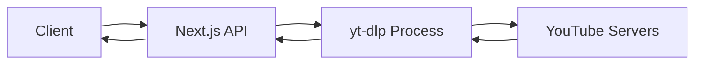
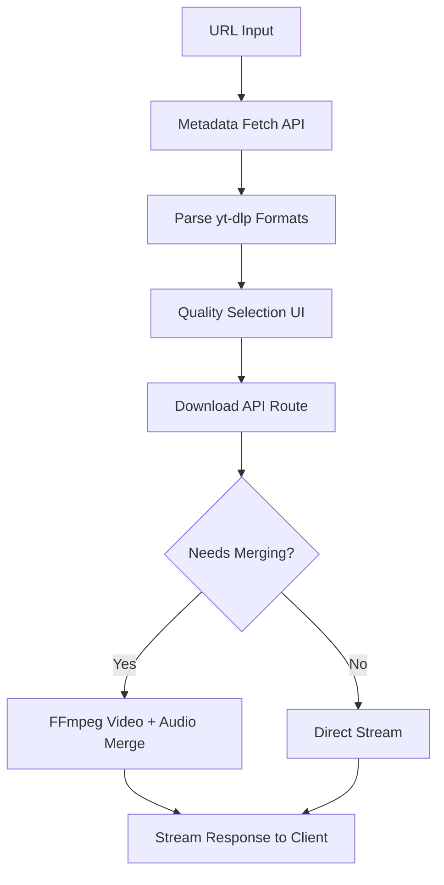
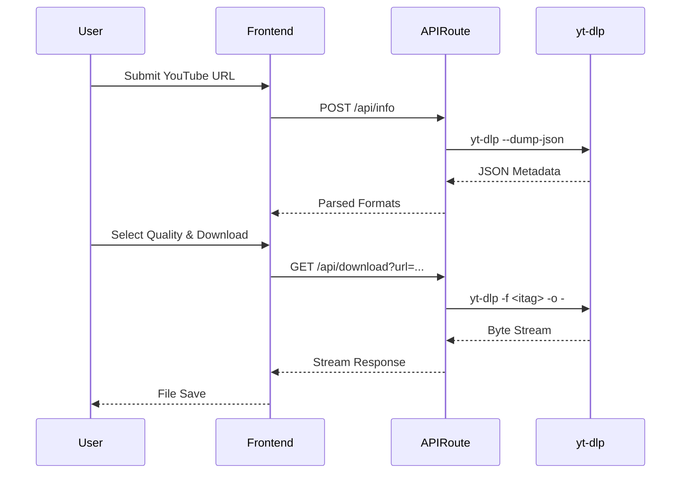

# YouTube Video Downloader

An open-source web interface for `yt-dlp` built with Next.js 15. It extracts native video formats and merges high-quality video and audio streams on the fly.

## Why this exists

Most online video downloaders are riddled with intrusive ads, malicious redirects, and fake download buttons. This project provides a clean, fast, and straightforward download experience. It wraps the powerful `yt-dlp` CLI tool behind a modern React interface, allowing you to download native formats (including 4K/8K where available) without navigating a maze of popups.

## Features

- **Native Format Extraction:** Fetches all available formats directly from YouTube using `yt-dlp`.
- **Dynamic Merging:** Uses `FFmpeg` to combine high-resolution video streams (which lack audio by default) with the highest quality audio streams.
- **Audio-Only Mode:** Extracts pure audio streams directly to MP3.
- **Zero Tracking:** No analytics, ads, or tracking scripts affecting the download flow.
- **Local History:** Saves recent downloads to local storage for quick access.

## Architecture

### High-level architecture



### Download flow



### Request lifecycle



## Tech Stack

- **Next.js 15** (App Router) → Application framework and API routes
- **TypeScript** → End-to-end type safety
- **Tailwind CSS** → Utility-first styling
- **Shadcn UI** → Accessible, unstyled component primitives
- **Framer Motion** → Layout animations and transitions
- **yt-dlp** → Core media extraction engine
- **FFmpeg** → Stream merging and format conversion

## Project Structure

```text
src/
├── app/                  # Next.js App Router (Pages, Layouts, API Routes)
│   ├── api/              # Server-side API endpoints
│   │   ├── download/     # Handles streaming and FFmpeg merging
│   │   ├── info/         # Handles yt-dlp metadata extraction
│   │   └── github/       # Cached GitHub stars fetcher
│   ├── about/            # Creator portfolio page
│   └── page.tsx          # Main downloader interface
├── components/           # React components
│   ├── ui/               # Reusable Shadcn UI primitives
│   ├── layout/           # Global header, footer, navigation
│   └── downloader-form.tsx # Core input and validation logic
├── lib/                  # Utilities (Analytics, classname merging)
└── store/                # Zustand state management (History)
```

## Installation

### Prerequisites

Ensure you have the following installed and available in your system path:
- [Node.js](https://nodejs.org/en/) (v18+)
- [Python 3](https://www.python.org/downloads/) (Required by yt-dlp)
- [FFmpeg](https://ffmpeg.org/download.html) (Required for merging A/V streams)

### Running locally

1. **Clone the repository:**
   ```bash
   git clone https://github.com/udaysharmadev/Youtube-Downloader.git
   cd Youtube-Downloader
   ```

2. **Install dependencies:**
   ```bash
   npm install
   ```

3. **Install yt-dlp globally:**
   ```bash
   # macOS
   brew install yt-dlp
   
   # Linux / Windows (via pip)
   python3 -m pip install -U yt-dlp
   ```

4. **Start the development server:**
   ```bash
   npm run dev
   ```

5. Open [http://localhost:3000](http://localhost:3000) in your browser.

## Contributing

We welcome contributions. Please review the [Contributing Guidelines](CONTRIBUTING.md) and [Code of Conduct](CODE_OF_CONDUCT.md) before submitting a pull request. 

For bug reports or feature requests, please [open an issue](https://github.com/udaysharmadev/Youtube-Downloader/issues).

## About the Author

Built by [Uday Sharma](https://github.com/udaysharmadev), a developer and founder of HackShastra. 

## License

This project is licensed under the [MIT License](LICENSE).
